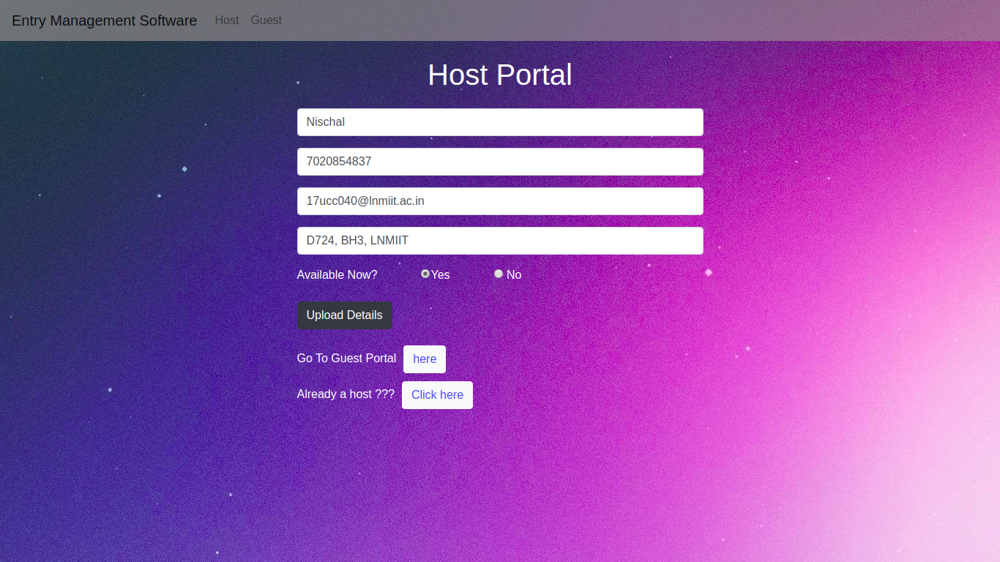

# Entry-Management-Software

This is a project for innovacer-summergeeks 2020, you can find the problem statement [here](https://summergeeks.in/static/assignments/summergeeks%202020%20-%20Design%20Assignment.pdf)

# Table of Contents

1.[Installation](#Installation)

2.[Setup](#Setup)

3.[Features](#Features)

a) Fixing a meeting

b) Scheduling a future meeting

c) Adding and Updating Hosts
 
d) Ending a meeting

5.List of Hosts and Guests

[Contact Me](#Contact-Me)

## Installation

1. Clone this repository.
2. Install the pre-requisites. To install via pip -


```bash
pip3 install -r requirements.txt
```

## Setup

1. Go into app.py and put your Gmail ID and Password there, make sure you have allowed access to less secure apps in the settings.

2. Go to Twilio and generate your Account SID and Authorisation token, you can follow this guide - [https://www.twilio.com/docs/sms/quickstart/python].

3. Make sure you have Python3 and other dependencies installed.

4. Run -

```python
python3 app.py
```

5. Your server will now be up and running on - [http://127.0.0.1:5000](http://127.0.0.1:5000)


## Features

### Fixing a meeting

The main home page gives the option to choose from hosts or guests, after choosing the guest the visitors can select from the hosts that are available, provide their details and instantly start a meeting.


### Scheduling a future meeting
We can also schedule future meetings from the guest portal.


To check-in, go to guestlist and start meeting at your scheduled time.


### Adding and Updating Hosts

Hosts can be added from Host Portal and their details can be updated in hostlist page.




### Ending a meeting

Guests can checkout anytime when the meeting is over.


## Contact Me

You can contact me at - [nischal.1106@gmail.com](mailto:nischal.1106@gmail.com)
